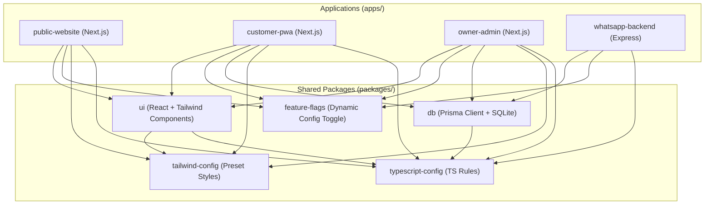

# Project Architecture

The Paddle Club Agra codebase is structured as a **Monorepo** managed with workspaces. This layout enables high code-sharing, separation of concerns, and clean boundaries between the public-facing site, the customer app, the admin dashboard, the automation APIs, and shared packages.

## Monorepo Dependency Diagram

Below is the conceptual dependency diagram showing how the applications and shared packages are connected:



---

## Workspace Breakdown

### 1. Applications (`apps/`)

*   **`public-website`** (Port `3000`): The public-facing marketing and landing page. It showcases key features, pricing, facilities (court types), Cafe Brio options, and general brand authority for the DayalBagh, Agra location.
*   **`customer-pwa`** (Port `3001`): A mobile-first Progressive Web Application (PWA) tailored for players. It allows customers to book court slots, order from the Cafe Brio menu, check in-progress orders, manage profiles, and track loyalty points.
*   **`owner-admin`** (Port `3002`): The dashboard for club managers and court owners. It monitors daily operations, handles slot occupancy, registers cafe sales, displays real-time WhatsApp automation chats, and displays global feature flag configurations.
*   **`whatsapp-backend`** (Port `5001`): An automation microservice running Express. It integrates with the Meta Cloud API to listen to WhatsApp Business webhooks, parse bookings or FAQs using AI heuristics, and auto-reply with links or slot confirmations.

### 2. Shared Packages (`packages/`)

*   **`db`**: Unified database access layer. Outlines the SQLite schema via **Prisma** and exposes the shared `prisma` client. Standardizes models for users, courts, bookings, orders, and logs.
*   **`feature-flags`**: Centralized feature management. Provides helper functions to check process environment variables or defaults for releasing features selectively (e.g., AI booking, table ordering).
*   **`ui`**: The design system components (buttons, layout cards, modals) packaged as reusable React components.
*   **`tailwind-config`**: Shared Tailwind configuration containing preset styling classes, colors, and layout dimensions.
*   **`typescript-config`**: Standardized TS settings so all apps and packages build under uniform strictness.

---

## Workspace Directory Map

```text
The-Paddle-Club/
├── apps/
│   ├── customer-pwa/         # Member Progressive Web App
│   ├── owner-admin/          # Manager/Admin panel
│   ├── public-website/       # Marketing & booking lander
│   └── whatsapp-backend/     # Meta webhook receiver for WhatsApp automation
├── packages/
│   ├── db/                   # Database client & schema definitions (Prisma + SQLite)
│   ├── feature-flags/        # Shared feature flags code
│   ├── tailwind-config/      # Root Tailwind parameters
│   ├── typescript-config/    # Global TS compiler settings
│   └── ui/                   # Shared React component library
├── package.json              # Monorepo packages mapping
└── pnpm-workspace.yaml       # Monorepo workspace boundaries (compatible with npm/pnpm)
```
