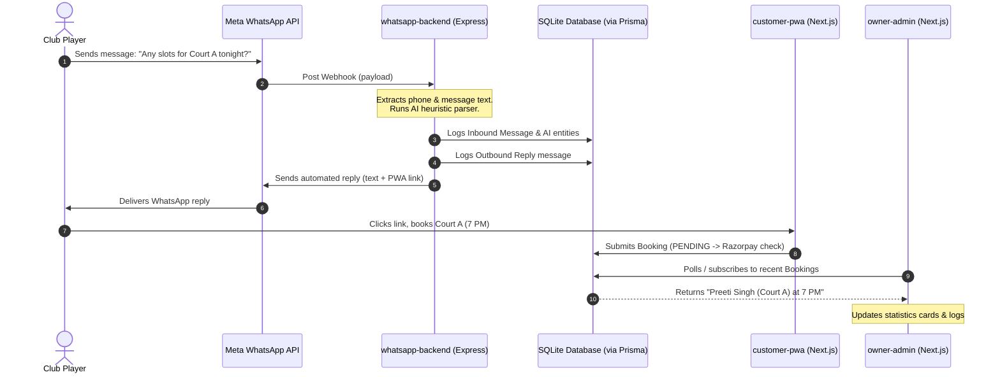

# Tech Stack & Connections

This document details the technologies chosen for The Paddle Club Agra platform, how they interlink, and the business goals of the codebase.

## Technology Stack

The platform is built on modern, standard, and highly performant technologies:

| Layer | Technology | Details |
| :--- | :--- | :--- |
| **Core Framework** | **Next.js 14 (App Router)** | Powers `public-website`, `customer-pwa`, and `owner-admin`. Enables static rendering for marketing pages and dynamic, client-side rendering for PWA dashboard tabs. |
| **Backend Integration** | **Express.js** | Powers the `whatsapp-backend` service. Listens to Webhooks, handles rapid network cycles, and performs API integrations. |
| **Database ORM** | **Prisma** | Maps database models to typescript interfaces. Facilitates database seeding, queries, and type safety across backend and web apps. |
| **Database** | **SQLite (`dev.db`)** | Simple, file-based SQL database suited for local development and rapid iterations. |
| **Styling** | **Tailwind CSS + PostCSS** | Powers responsive grids, dark theme configurations, and custom utility variables (e.g., `brand-court`, `brand-cafe`). |
| **Logic & Safety** | **TypeScript** | Ensures type safety for models, components, props, and API payloads across the monorepo workspaces. |
| **Animations** | **Framer Motion** | Controls premium typography typewriter headers and UI transition layouts. |
| **Icons** | **Lucide React** | Outlines minimal vectors for sports, cafe, and admin operations (coffee, shield, clock, etc.). |

---

## Connection Flow Diagram

The following Mermaid flowchart shows how data, actions, and features flow between the components:

---

## How Things Are Connected

### 1. Database Connections
The `@paddle-club/db` package compiles a single Prisma Client instance. 
*   Both the Next.js applications (`customer-pwa`, `owner-admin`) and the Express application (`whatsapp-backend`) list this package as a local monorepo dependency.
*   They all read and write to the exact same file-based SQLite database located at `packages/db/prisma/dev.db`.
*   This ensures that whenever a WhatsApp automation writes a message log or an AI intent result, it is immediately queryable on the admin panel; similarly, when a customer submits a booking on the PWA, it updates the admin stats.

### 2. Feature Flags Pipe
The `@paddle-club/feature-flags` package exports functions to evaluate toggle statuses.
*   By reading environment variables (`process.env.FEATURE_...` or `NEXT_PUBLIC_FEATURE_...`), components dynamically disable/enable modules.
*   For instance, if `FEATURE_RESTAURANT_MENU_BOOKING` is disabled, the PWA displays a "Cafe Booking Offline" card, and the Admin dashboard marks Cafe Brio Sales as "OFFLINE".

### 3. Shared Design Tokens
The `@paddle-club/ui` component library relies on `@paddle-club/tailwind-config` to apply colors (`bg-brand-dark-card`, `text-brand-court`) and styles consistently. When custom UI components are modified, changes propagate instantly to all frontends.

---

## What We Are Doing

We are building a **unified digital ecosystem** for a premium sports and dining destination (The Paddle Club, located in DayalBagh, Agra). 

### The Problem We Solve
Traditionally, sports clubs run their booking system on third-party aggregators, their restaurant POS on another platform, and their marketing on static builders. This fragments client profiles, sales analytics, and scheduling logs.

### Our Solution
1.  **Championship Sports Booking**: Players reserve premium pickleball/padel courts via a fast, mobile-friendly PWA.
2.  **Aesthetic Dine-In Integration**: Diners at Cafe Brio order food directly to tables or court-side through the PWA interface.
3.  **Conversational Commerce (WhatsApp AI)**: Players check court slot availability, receive booking links, or review cafe menus by text message.
4.  **Operational Centralization**: Club owners get a single administrative control center to toggle features (like toggling Cafe ordering during peak times) and track combined court/cafe revenues in real-time.
